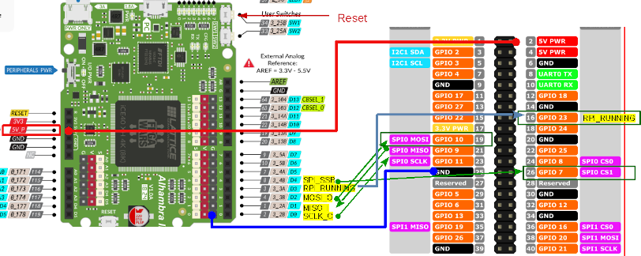

# FPGA - SPI - GoPiGo3

Alhambra II - GoPiGo3 SPI connection:

Note that GoPiGo3 provides power to the Alhambra.
To be on the safe side:
1. Program the Alhambra without the 5V power cable to the GoPiGo3. GoPiGo3 is not attached to the power (battery or plug)
1. Unplug the Alhambra from the computer
1. Connect the 5V power cable from GoPiGo3 to Alhambra
1. Plug the GoPiGo3 to the power (battery or plug)
1. Press the GoPiGo3 power button

## SPI POC

SPI proof of concept: 
The objective is to have a verilog module (using Apio) to send SPI commands from the Alhambra II FPGA to the GoPiGo3 board.
In the original GoPiGo Robot, the Raspberry Pi and the GoPiGo3 board communication is done via SPI. With this proof of concepts we test that we can communicate with the GoPiGo3 board via SPI, but using the Alhambra II FPGA instead of the Raspberry.
In this proof of concept we just turn on a led, using the same commands as the Raspberry. Similar to this: https://github.com/DexterInd/GoPiGo3/blob/master/Software/Python/gopigo3.py

SPI proof of concept: 

The bytes sent to the GoPiGo3 via SPI are:
1. 0x08 -> SPI address
1. 0x06 -> SET_LED command
1. 0x04 -> set blinker left
1. 0x10 -> Red intensity (from 0x00 to 0xFF)
1. 0x1F -> Green intensity (from 0x00 to 0xFF)
1. 0x1A -> Blue intensity (from 0x00 to 0xFF)

Check for more commands:
https://github.com/DexterInd/GoPiGo3/blob/master/Software/Python/gopigo3.py

## SPI ROM

SPI bytes to send are stored in a ROM, what gives more flexibility in order to modify the commands than in the SPI POC.
The ROM is in the spi_romctrl.v file

