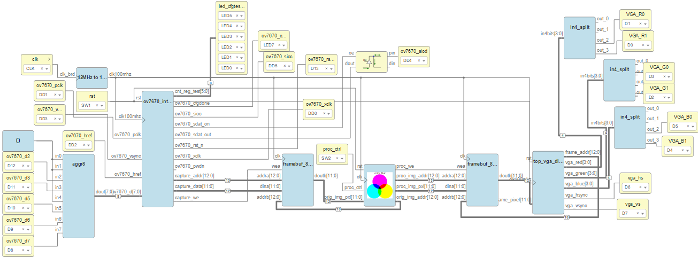
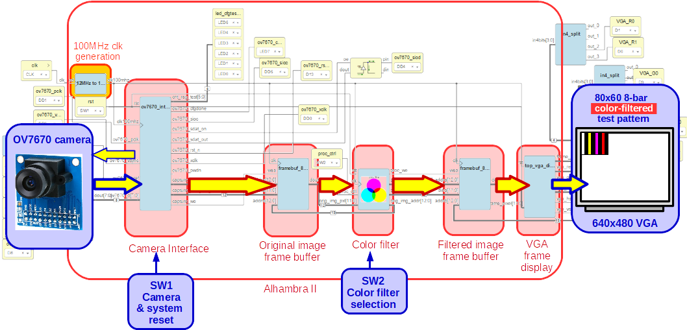

The goal of this project is to perform image processing inside FPGAs, different operations like edge computation, color filtering, convolutions...

- Basics/HexImgStorage:

  
  
  
- Basics/HexImageFilter:

  

- HexToVGA:

  

  
- ov7670_test:
  Same project as the Apio ov7670_rgb444_80x60 adapted for icestudio.
  
  

- ov7670_color_proc:
  Same project as the Apio ov7670_rgb444_80x60_color_proc adapted for icestudio.
  
  
  
### Alhambra II Apio projects

- vga_test_100mhz
  Display a test card on a 640x480 VGA with Alhambra II using 100MHz PLL generated clock
  
- ov7670_rgb444_80x60
  Display 80x60 video on a VGA from the ov7670 camera using Alhambra II
  Camera in test mode

- ov7670_rgb444_80x60_color_proc
  ov7670 camera capture, color processing and 80x60 VGA display using Alhambra II
  Camera in test mode QQVGA/2 (80x60)

  
   
  
  
### ov7670_xilinx: 
Interfacing the OV7670 camera with a Xilinx Nexys4 FPGA and displaying the video through VGA. Next step is to do it with an Alhambra II FPGA board. There are 2 versions:
  + VHDL
  + Verilog
  
