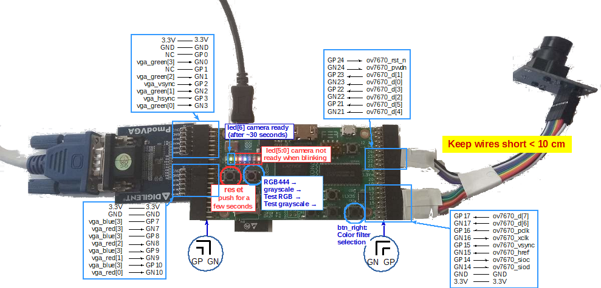
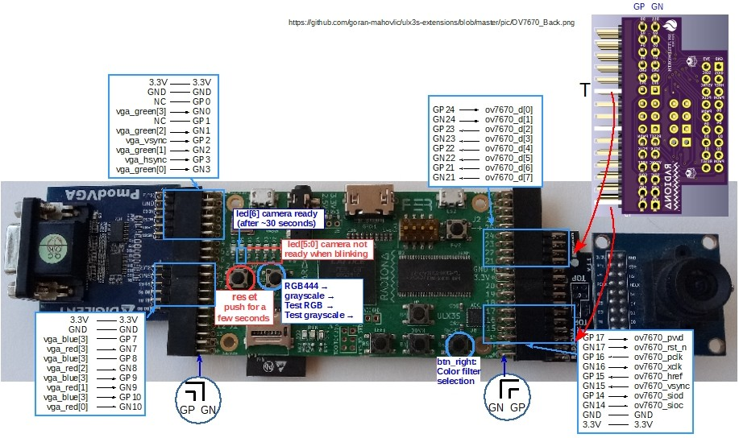
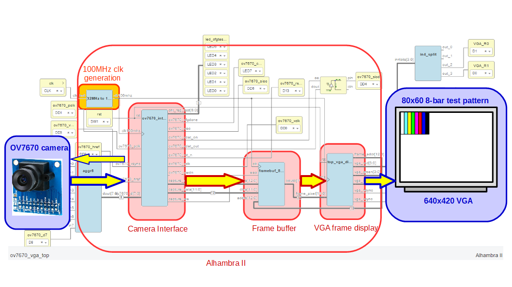
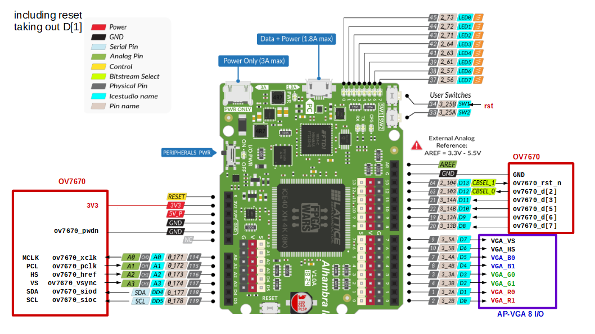
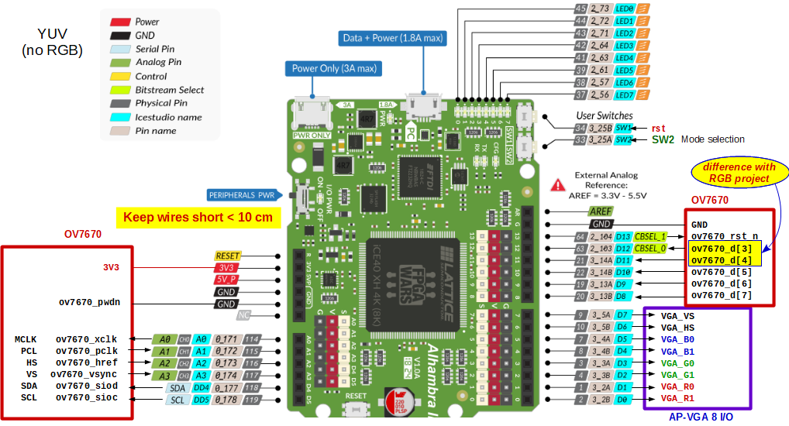

The goal of this project is to perform image processing inside FPGAs, different operations like edge computation, color filtering, convolutions...

- Basics/HexImgStorage:

  
  
  
- Basics/HexImageFilter:

  

- HexToVGA:

  

---
# ULX3S

Projects for the ULX3S. There are two folders

* [icestudio](ulx3s/icestudio): projects using Icestudio: https://icestudio.io/
* [apio](ulx3s/apio): projects in verilog using Apio: https://apiodoc.readthedocs.io

## ULX3S Icestudio projects

### [ov7670_rgb_yuv_320x240_colorfilter](ulx3s/icestudio/ov7670_rgb_yuv_320x240_colorfilter)

Same as Apio project but in Icestudio. Color from camera needs some improvement.
Color filter with a 50MHz clock

Capture 320x240 image from ov7670

btn2 switches between RGB (RN), YUV (YN), and color test bar for both (RT and YT).

btn6 (right) switches between color filters. If color filter active, there will be a smal square with the active color filter (after RN, YN, RT, YT).
The color filter will not have effect in YUV mode because the only the Y is taken, so there is no color in the image.

btn1 is reset

To programm the FPGA fujprog is used after generating the .bit file with Icestudio.
https://github.com/kost/fujprog

Video: https://youtu.be/PyhVvvYumsc

## ULX3S Apio projects

### [ov7670_rgb_yuv_320x240_rg](ulx3s/apio/ov7670_rgb_yuv_320x240_rg)

Capture 320x240 image from ov7670, btn2 switches between RGB, YUV, and color test bar for both.

btn1 is reset. It should be reset for a second, then wait around 30 seconds until led[6] is ON

### [ov7670_rgb_yuv_320x240_rg_50mhz](ulx3s/apio/ov7670_rgb_yuv_320x240_rg_50mhz)

Same as previous but using a 50MHz clock, since there were timming warnings at 100MHz
Capture 320x240 image from ov7670, btn2 switches between RGB, YUV, and color test bar for both.

btn1 is reset

### [ov7670_rgb_yuv_320x240_colorfilter](ulx3s/apio/ov7670_rgb_yuv_320x240_colorfilter)

Same as Icestudio project.
Color processing with a 50MHz clock
Capture 320x240 image from ov7670, btn2 switches between RGB, YUV, and color test bar for both.

btn1 is reset. It should be reset for a second, then wait around 30 seconds until led[6] is ON

btn2 switches between RGB (RN), YUV (YN), and color test bar for both (RT and YT).

btn6 (right) switches between color filters. If color filter active, there will be a smal square with the active color filter (after RN, YN, RT, YT).
The color filter will not have effect in YUV mode because the only the Y is taken, so there is no color in the image.

### [ov7670_rgb_yuv_320x240_colorfilter_pmodcam](ulx3s/apio/ov7670_rgb_yuv_320x240_colorfilter_pmdocam)

Same as ov7670_rgb_yuv_320x240_colorfilter but usign the camera PMOD

Port GP17-OV7670_PWDN didn't work when camera powerdown was assigned deep in the hierarchy, but when assigned in the top module it worked

### [ov7670x2_centroid_160x120](ulx3s/apio/ov7670x2_centroid_160x120)

Two cameras and VGA. 50MHz clock. Same as Xilinx Nexys4DDR project

---  
  
# Alhambra II

Projects for the Alhambra II FPGA. There are two folders:

* [icestudio](alhambra_ii/icestudio): projects using Icestudio: https://icestudio.io/
* [apio](alhambra_ii/apio): projects in verilog using Apio: https://apiodoc.readthedocs.io

## Alhambra II Icestudio projects
  
### [ov7670_test](alhambra_ii/icestudio/ov7670_test)

  Same project as the Apio ov7670_rgb444_80x60 adapted for icestudio.
  
  

### [ov7670_colorfilter](alhambra_ii/icestudio/ov7670_colorfilter)

  Same project as the Apio ov7670_rgb_yuv_80x60 adapted for icestudio.

  SW1: reset, necessary to start

  SW2 choose between:

  RGB -> RGB test -> YUV -> YUV test -> RGB

  The drawback of choosing is that you loose pins for YUV, and you can only get 3 bits of gray color, without choosing you could get 5

  

### [ov7670_yuv_sobelfilter](alhambra_ii/icestudio/ov7670_yuv_sobelfilter)

  Same project as the Apio ov7670_yuv_80x60_sobel_50mhz adapted for icestudio.

  Shows image in grayscale
  
  Once it is loaded, press SW1 to reset the camera
  
  Press SW2 to change to Sobel Horizontal Filter -> Sobel Vertical Filter -> No filter (in gray scale)
  
  

### [ov7670_colorcentroid](alhambra_ii/icestudio/ov7670_colorcentroid)

  Same as the Apio ov7670_rgb444_80x60_color_centroid project

  
## Alhambra II Apio projects
It is important to connect the camera with short wires (10 cm at most)

### [vga_test_100mhz](alhambra_ii/apio/vga_test_100mhz)
  
  Display a test card on a 640x480 VGA with Alhambra II using 100MHz PLL generated clock

### [ov7670_rgb444_80x60](alhambra_ii/apio/ov7670_rgb444_80x60)
  
  Display 80x60 video on a VGA from the ov7670 camera using Alhambra II
  
  Camera in test mode

### [ov7670_rgb444_80x60_color_proc](alhambra_ii/apio/ov7670_rgb444_80x60_color_proc)  
 
  
  ov7670 camera capture, color processing and 80x60 VGA display using Alhambra II
  
  Camera in test mode QQVGA/2 (80x60)

### [ov7670_rgb444_80x60_color_centroid](alhambra_ii/apio/ov7670_rgb444_80x60_color_centroid)

  50 MHz clock
  ov7670 camera capture, color processing, 80x60 VGA display using Alhambra II, and shows on the leds where the horizontal centroid is
  
  sw2 selects the color for the filter, initially there is no filter, so press it once to have red filter, and then: green -> blue -> yellow -> magenta -> cyan -> white -> none -> red -> ... 
  
  The VGA shows where the horizontal centroid is and also the proximity of the object (counts how many pixels are detected), the result is reduced to 8 bits.
  Maximum value is when half of the pixels are detected. Then 1/3, 1/6, 1/12, 1/24, 1/48, 1/96, and less.
  
  
### [ov7670_rgb_yuv_80x60](alhambra_ii/apio/ov7670_rgb_yuv_80x60)  
  
  SW1: reset, necessary to start
  
  SW2 choose between:
  
  RGB -> RGB test -> YUV -> YUV test -> RGB

  The drawback of choosing is that you lose pins for YUV, and you can only get 3 bits of gray color, without choosing you could get 5

### [ov7670_rgb_yuv_80x60_50mhz](alhambra_ii/apio/ov7670_rgb_yuv_80x60_50mhz)      

  
  The same as the previous, but configures the PLL to have a clock of 50MHz instead of 100MHz to see if there is any improvement. It doesnt seem to be; however, the timming analysis suggest a clock frequency of 80MHz (or less)

  
  

### [ov7670_yuv_80x60_sobel](alhambra_ii/apio/ov7670_yuv_80x60_sobel) 
  
  SW1: reset, necessary to start
  
  SW2 choose between:
    No filter grayscale -> Sobel horizontal filter -> Sobel Vertical filter -> No filter grayscale.
    
  When pressed more than a second -> test mode

### [ov7670_yuv_80x60_sobel_50mhz](alhambra_ii/apio/ov7670_yuv_80x60_sobel_50mhz)  

  Same as previous, but configures the PLL to have a clock of 50MHz instead of 100MHz to see if there is any improvement. It doesnt seem to be; however, the timming analysis suggest a clock frequency of 80MHz (or less)
  
   

---
  
# Nexys4DDR Xilinx projects

Interfacing the OV7670 camera with a Xilinx Nexys4 FPGA and displaying the video through VGA.  There are VHDL and verilog versions

### [ov7670_rgb_yuv_80x60](xilinx_nexys4/ov7670_rgb_yuv_80x60) 

Option to choose between RGB or YUV (only Y). Also camera can be in test mode or normal capture
  
### [ov7670_rgb_yuv_80x60_filter](xilinx_nexys4/ov7670_rgb_yuv_80x60_filter)   

Option to choose between RGB or YUV (only Y). Also, camera can be in test mode or normal capture. And choose color filter when in RGB and edge Sobel filter when in YUV

### [ov7670_rgb_yuv_320x240_rg](xilinx_nexys4/ov7670_rgb_yuv_320x240_rg)

Same as [ULX3S](ulx3s/apio/ov7670_rgb_yuv_320x240_rg) project but for Xilinx Nexys4DDR. Only in verilog

### [ov7670_colorcentroid_80x60](xilinx_nexys4/ov7670_colorcentroid_80x60)

Same as [AlhambraII](alhambra_ii\apio\ov7670_rgb444_80x60_color_centroid) project but for Xilinx Nexys4DDR. Only in verilog. Using the same 50MHz clock

### [ov7670_colorcentroid_160x120](xilinx_nexys4/ov7670_colorcentroid_160x120)

Color centroid and proximity calculation using 160x120 image

### [ov7670x2_colorcentroid_160x120](xilinx_nexys4/ov7670x2_colorcentroid_160x120)

Two cameras, color centroid and proximity calculation using 160x120 image
  
