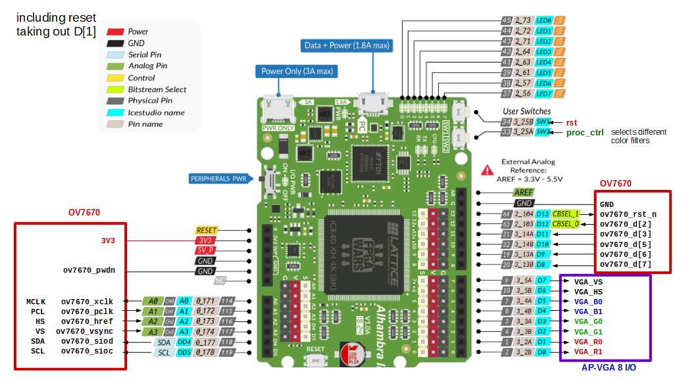

# Icestudio Color Filter with OV7670 camera and Alhambra II FPGA
  
  Same project as the Apio ov7670_rgb444_80x60_color_centroid adapted for icestudio.

  SW1: reset, necessary to start  

  SW2 choose between:

  nofilter -> red -> green -> blue -> yellow -> magenta -> cyan -> white -> none -> red -> ... 

  
  
  

