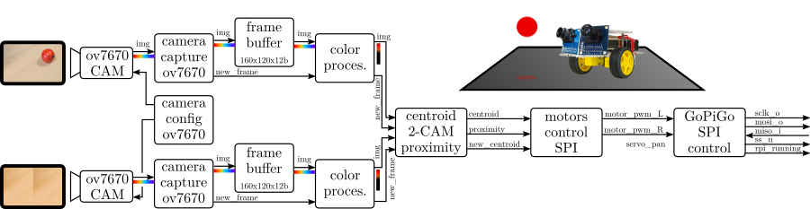

# FPGA-Robotics Collection

JdeRobot collection in the development area of Reconfigurable Computing in Robotics. FPGA-robotics  designs the robot control using IceStudio blocks.

This collection contains the necessary blocks for the GoPiGo3 robot and examples of how to use it with Alhambra II.

**Create a .zip of the FPGA-Robotics-v1-stable folder to add the collection to icestudio.**

Follow us:

 * [Twitter](https://twitter.com/JdeRobot)
 * [YouTube](https://www.youtube.com/channel/UCgmUgpircYAv_QhLQziHJOQ/) - [JdeRobot FPGA Playlist](https://youtube.com/playlist?list=PLGlX46StCA-S-c_dXHtn4Qiod5_lQgYn-)

## Install

* Download the collection: [stable](https://github.com/Obijuan/Academia-Jedi-Hw/archive/v1.0.zip)
* Install the collection: *Tools > Collections > Add*
* Load the collection: *Select > Collection*

## Blocks
* *GoPiGo*:
	* **gopigo_spi_ctrller**: Receives Motor PWM and leds commands for the GoPiGo3, and send them via SPI. Before sending them, check if there has been any change since the last sending.
	* **motors_ctrl_v4**: Control for motors in closed loop with centroid and proximity. The speed of the motors is generated for the GoPiGo SPI Controller block. 
* *Image*:
	* *ov7670 Camera*: Blocks related to the OV7670 camera.
		* **ov7670_iface**: Interfaz para la cámara ov7670. Contiene los bloques ov7670_ctrl, ov7670_capture.
		* **framebuff_80x60_12b**: Buffer block for the image.
			* *Others*
				* **ov7670_ctrl**: Module in charge of telling the SCCB module what registers to write in the camera camera and to control the camera inputs. Module in charge of the SCCB communication with the OmniVision OV7670 camera. SCCB (Serial Camera Control Bus) is like the I2C. This module is the master.
				* **ov7670_capture**: Block that controls image capture.
		
	* *Processing*: Blocks related to image processing.
		* **color_processing**: Basic version of image processing for the color filter.
		* **color_processing_v3**: Advanced version of image processing for the color filter. The centroid and proximity are obtained at the output.
		* **mode_sel**: Block to select the filter mode for the basic color processing block (color_processing). 
	* *Visualization*: Blocks related to visualization. 
		* **vga_display**: Block to display the image on a VGA screen.
* *Others*:
	* *Bits*:
		* **bit0**: bit set to 0.
		* **bit1**: bit set to 1.
	* *Bus*:
		* **bus_0_16_bits**: 16-bit bus set to 0.
		* **bus_8bits**: Aggregates bits on an 8-bit bus.
		* **In4_split**: Splits 4-bit bus into independent bits.
	* *Clocks*:
		* **clk_100MHz**: 100 MHz clock.
	
## Examples
* **ov7670_vga**: Example to use the camera and display the image through the VGA on the screen.
* **followRedBall_v7**: Example following an object with different colors depending on the filter selected with SW2 (red, green, blue, cyan, yellow, magenta and white).  
 
    Diagram:
  

   This is a video of the robot:
   [Video of the robot following the ball](https://youtu.be/rbdQ36ZJ7Lo)

## Authors
* [JdeRobot](https://github.com/JdeRobot/FPGA-robotics)

## License

Licensed under [GPL-2.0](https://opensource.org/licenses/GPL-2.0).
