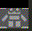

This test bench adds a new module for color filtering through the filter_X signals.

---Filter R component--->

The original image was too big for a 3x1024 Memory, that's why the output is trimmed. there seems to be some problem displaying the .bmp in this README so I made some png screenshots. But the original .bmp files used can be seen with in "Raw" mode.
