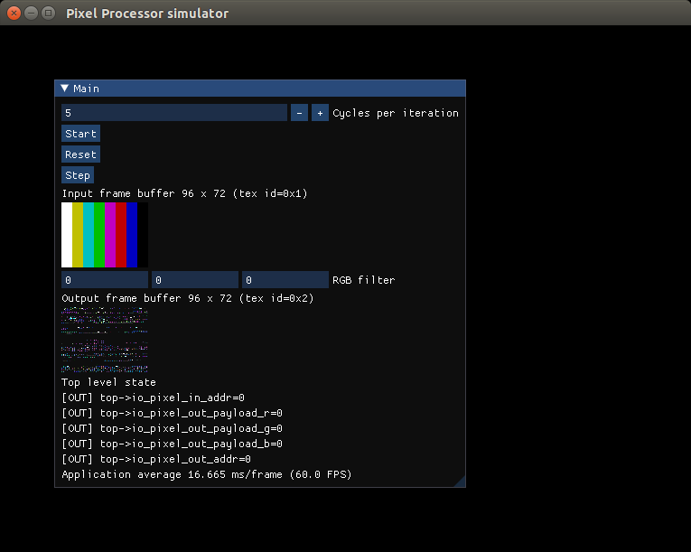
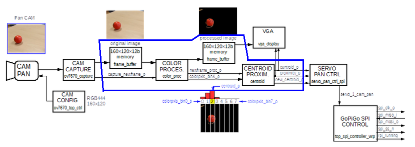

# Building simulators with verilator
In this project we build hardware simulators using [Verilator](https://www.veripool.org/verilator/).
The project includes verilog RTL designs that implements a pixel processor.

In addition the verilated design is linked againts the popular [ImGui](https://github.com/ocornut/imgui) to create a simulation tool with a graphic UI.

## Dependencies

To build the simulator you need:
1. C++ compiler
2. Verilator: https://verilator.org/guide/latest/install.html

To regenerate the rtl design from the SpinalHDL sources you will need also [sbt](https://www.scala-sbt.org/).

## Build the simulator
```
$> cd sim
$> make
```

## Rebuild RTL design
```
$> sbt "runMain jderobot.TopPixelProcessor"
```

## Run the simulator
```
sim/obj_dir/VTopPixelProcessor
```



---

## Tutorial

In [tutorial](./tutorial) there are some examples with more information on how to use [Verilator](https://www.veripool.org/verilator/) with [ImGui](https://github.com/ocornut/imgui)


---

## Example 6
Test the processing modules of:

   FPGA-robotics/Projects/ComputerVision/ulx3s/apio/ov7670x3_vga160x120_spipan/

Tested modules are inside the blue area:



