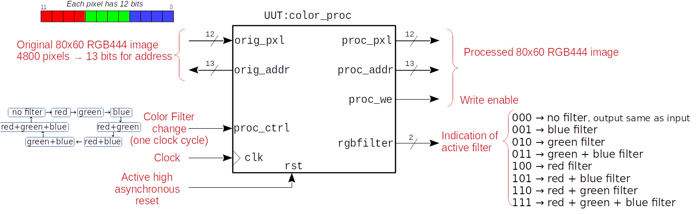

# Tutorial 1

Visually test the color processing module with [Verilator](https://www.veripool.org/verilator/) and a graphical interface.

The color processing module has been taken from:

* [../../../phys_fpga/ulx3s/apio/ov7670_rgb_yuv_320x240_colorfilter/color_proc.v](../../../phys_fpga/ulx3s/apio/ov7670_rgb_yuv_320x240_colorfilter/color_proc.v)

, but also it is very similar to all the color processing modules, such as the one used in the Alhambra II project:

* [../../../phys_fpga/alhambra_ii/apio/ov7670_rgb444_80x60_color_proc/color_proc.v](../../../phys_fpga/alhambra_ii/apio/ov7670_rgb444_80x60_color_proc/color_proc.v)

The color processing module requests a 12-bit RGB444 pixel from a 80x60 memory and in the following clock cycle it sends the processed pixel and its corresponding address to be written in a processed memory.

The input/output schematic of this module is shown in the following block diagram:

Our objective is to convert the color processing block (the Unit Under Test: UUT) from Verilog into C++ using Verilator, and then create a testbench in C++ in which we provide the stimuli to the UUT.
Instead of generating the waveforms as in traditional testbenches, we are going to provide a C++ generated image and visualize the filtered image.
This is one of the great advantages of this approach because it is very difficult to appreciate the color filtering results by looking at waveforms.

