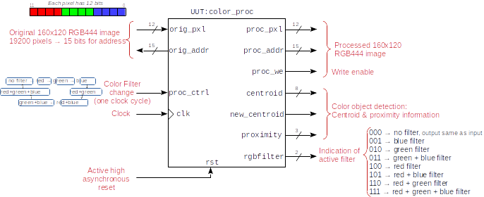
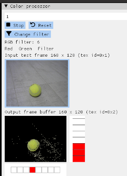
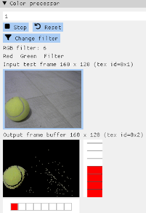

# Verilator+GUI Tutorial 3

Instead of images, the program takes the live captures of the computer camera.

The color processing is the same as in tutorial 2.

* [../../../phys_fpga/ulx3s/apio/ov7670x2_colorcentroid_160x120/color_proc.v](../../../phys_fpga/ulx3s/apio/ov7670x2_colorcentroid_160x120/color_proc.v)

The rest is the same as in tutorial 2.

For the ULX3S the color processing module requests a 12-bit RGB444 pixel from a **160x120** memory and in the following clock cycle it sends the processed pixel and its corresponding address to be written in a processed memory. It also includes a 8-bit centroid horizontal position, and a 3-bit proximity level. The larger the proximity, the closer the detected object is.

The input/output schematic is the same as in tutorial 2:

## Easier GUI debugging

The graphical interface allows debugging more easily. For example, the next screenshots show the processing of two different camera captures. The verilator processing is performed on the fly.

