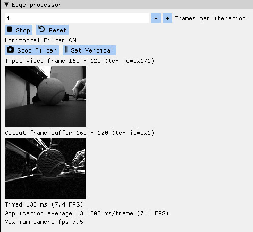
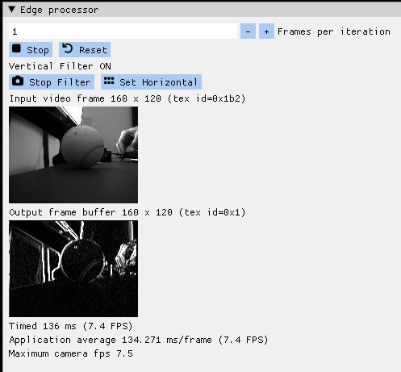
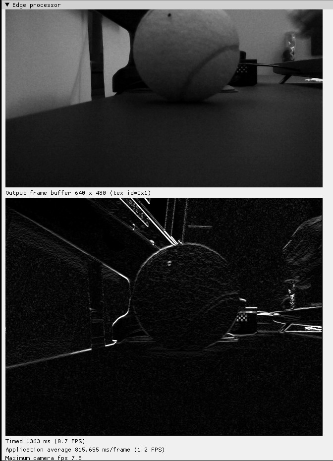

# Verilator+GUI Tutorial 5

Edge processing using Sobel filter.

The edge processing has been modified from:

* [../../../phys_fpga/alhambra_ii/apio/ov7670_yuv_80x60_sobel/edge_proc.v](../../../phys_fpga/alhambra_ii/apio/ov7670_yuv_80x60_sobel/edge_proc.v)

---

---

---

## Change image size

To change the image size, you just have to change both src/main.cpp and rtl/edge_proc.v

In src/main.cpp change the following lines to the desired values, here for example to 640x480

    const int IMG_COLS = 640; 
    const int IMG_ROWS = 480; 

In rtl/edge_proc.v change the following lines to the same desired values

    c_img_cols    = 640, // 10 bits
    c_img_rows    = 480, //  9 bits

The achieved fps are much lower (less than 1fps):

