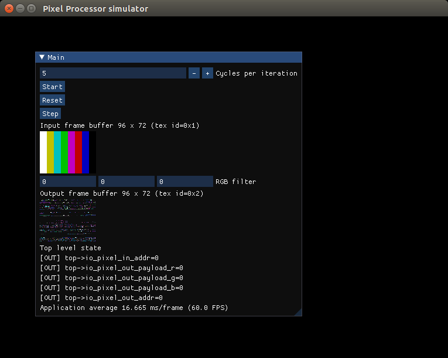

# A proof of concept on building simulators with verilator
This is a proof of concept on how to build hardware simulators using [verilator](https://www.veripool.org/verilator/).
The project includes a simple verilog rtl design that implements a pixel processor. 
The design is as simplistic as possible, up to the point that it might not be correct nor very useful, 
but enough to showcase a simulator where inputs and outputs are not straighforward, such us images.

In addition the verilated design is linked againts the popular [ImGui](https://github.com/ocornut/imgui) to create a simulation tool with a graphic UI.

## Dependencies

To build the simulator you need:
1. C++ compiler
2. Verilator: https://verilator.org/guide/latest/install.html

To regenerate the rtl design from the SpinalHDL sources you will need also [sbt](https://www.scala-sbt.org/).

## Build the simulator
```
$> cd sim
$> make
```

## Rebuild RTL design
```
$> sbt "runMain jderobot.TopPixelProcessor"
```

## Run the simulator
```
sim/obj_dir/VTopPixelProcessor
```

